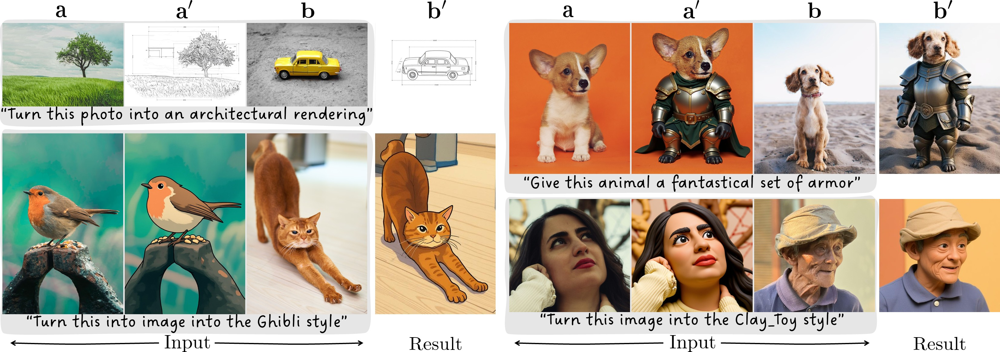

<!-- omit in toc -->
# LoRWeB: Spanning the Visual Analogy Space with a Weight Basis of LoRAs

<div align="center">

[](https://arxiv.org/abs/2602.15727)
[](https://research.nvidia.com/labs/par/lorweb)
[](https://huggingface.co/datasets/hilamanor/LoRWeB_evalset)
[](https://huggingface.co/hilamanor/lorweb)

</div>

<div align="center">
  
</div>
## 👥 Authors

<div align="center">

**Hila Manor**<sup>1,2</sup>,&ensp; **Rinon Gal**<sup>2</sup>,&ensp; **Haggai Maron**<sup>1,2</sup>,&ensp; **Tomer Michaeli**<sup>1</sup>,&ensp; **Gal Chechik**<sup>2,3</sup>

<sup>1</sup>Technion - Israel Institute of Technology  &ensp;&ensp; <sup>2</sup>NVIDIA &ensp;&ensp; <sup>3</sup>Bar-Ilan University

<br>



*Given a prompt and an image triplet $\{a,a',b\}$ that visually describe a desired transformation, LoRWeB dynamically constructs a single LoRA from a learnable basis of LoRA modules, and produces an editing result $b'$ that applies the same analogy to the new image.*

</div>

## 📄 Abstract

Visual analogy learning enables image manipulation through demonstration rather than textual description, allowing users to specify complex transformations difficult to articulate in words. Given a triplet $\{a,a',b\}$, the goal is to generate $b'$ such that $a$ : $a'$ :: $b$ : $b'$.
Recent methods adapt text-to-image models to this task using a single Low-Rank Adaptation (LoRA) module, but they face a fundamental limitation: attempting to capture the diverse space of visual transformations within a fixed adaptation module constrains generalization capabilities.
Inspired by recent work showing that LoRAs in constrained domains span meaningful, interpolatable semantic spaces, we propose **LoRWeB**, a novel approach that specializes the model for each analogy task at inference time through dynamic composition of learned transformation primitives, informally, choosing a point in a "*space of LoRAs*". We introduce two key components: (1) a learnable basis of LoRA modules, to span the space of different visual transformations, and (2) a lightweight encoder that dynamically selects and weighs these basis LoRAs based on the input analogy pair. Comprehensive evaluations demonstrate our approach achieves state-of-the-art performance and significantly improves generalization to unseen visual transformations. Our findings suggest that LoRA basis decompositions are a promising direction for flexible visual manipulation.

## 📋 Table of Contents

- [Setup](#-setup)
- [Usage](#-usage)
  - [Training](#-training)
  - [Inference](#-inference)
  - [Additional Information](#-additional-information)
- [Citation](#-citation)
- [Acknowledgements](#-acknowledgements)

## 🔨 Setup

```bash
conda env create -f environment.yml
conda activate lorweb
```

## 🚀 Usage

### 💻 Training

Train a LoRWeB model on your visual analogy dataset:

```bash
python run.py config/your_config.yaml
```

You can override the main options with arguments to the `run.py` script, e.g. `python run.py LoRWeB_default_PROMPTS.yaml --name "lorweb_model" --linear 4 --linear_alpha 4 --loras_num 32 --lora_softmax true --query_mode "cat-aa'b"`

#### 📊 Training Data Format

We trained on [Relation252k](https://huggingface.co/datasets/handsomeWilliam/Relation252K/tree/main).
The training script expects 2 folder: `control` - which will contain images of the $\{a,a',b\}$ triplets, and `target` which contains images of the corresponding $b$ image.
Use `preprocess_data.py` to preprocess a pre-downloaded dataset.

### 🎨 Inference

You can test a reproduced* model checkpoint from [HuggingFace](https://huggingface.co/hilamanor/lorweb) using `inference.py`.

```bash
python inference.py -w "output/your_model/your_model.safetensors" -c "output/your_model/config.yaml" -a "data/path_to_a_img.jpg" -t "data/path_to_atag_img.jpg" -b "data/patH-to_b_img.jpg" -o "outputs/generated_btag_img_path.jpg"
```

\*This checkpoint is a reproduction of our model's checkpoint from the paper, trained on Technion hardware. Some differences from the results reported in the paper and obtained via the original checkpoint are expected. Please see `samples` for examples on the expected differences. These results can be reproduced via downloading the evluation set and the original images and running e.g.:

```bash
python inference.py -w "lorweb_model/lorweb_model.safetensors" -c "config.yaml" -a "data/original/unsplash_animals/alvan-nee-brFsZ7qszSY-unsplash.jpg" -t "data/decoded_random_inference_set/db_not_in_trainset/animals/Give_this_animal_a_fantastical_set_of_armor/alvan-nee-brFsZ7qszSY-unsplash_2.png" -b "data/original/unsplash_animals/ryan-walton-AbNO2iejoXA-unsplash.jpg" -o "samples/armor_doggy.jpg" -p "Give this animal a fantastical set of armor"
```

### ℹ️ Additional Information

Our complementary custom evaluation set is available on [HuggingFace](https://huggingface.co/datasets/hilamanor/LoRWeB_evalset).

## 📚 Citation

If you use this code in your research, please cite:

```bibtex
@article{manor2026lorweb,
    title={Spanning the Visual Analogy Space with a Weight Basis of LoRAs},
    author={Manor, Hila and Gal, Rinon and Maron, Haggai and Michaeli, Tomer and Chechik, Gal},
    journal={arXiv preprint arXiv:2602.15727},
    year={2026}
}
```

## 🙏 Acknowledgements

This project builds upon:
- [FLUX.1-Kontext](https://huggingface.co/black-forest-labs/FLUX.1-Kontext-dev) by Black Forest Labs
- [Diffusers](https://github.com/huggingface/diffusers) by Hugging Face
- [PEFT](https://github.com/huggingface/peft) by Hugging Face
- [AI-Toolkit](https://github.com/ostris/ai-toolkit) for training infrastructure

---

<div align="center">

**⭐ Star this repo if you find it useful! ⭐**

</div>
